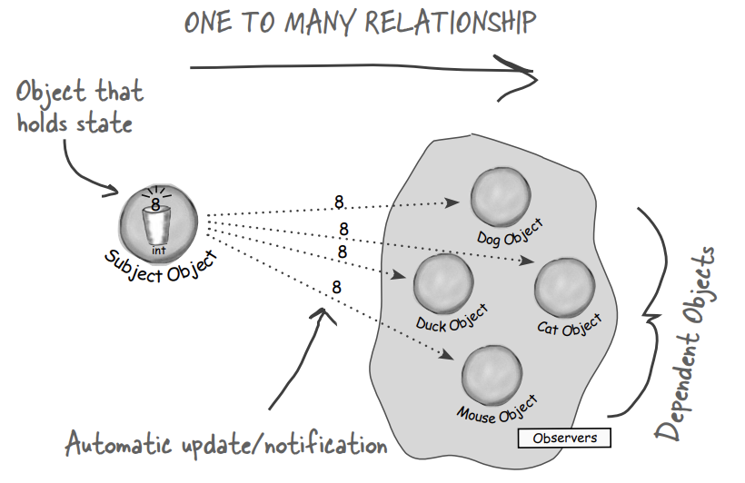
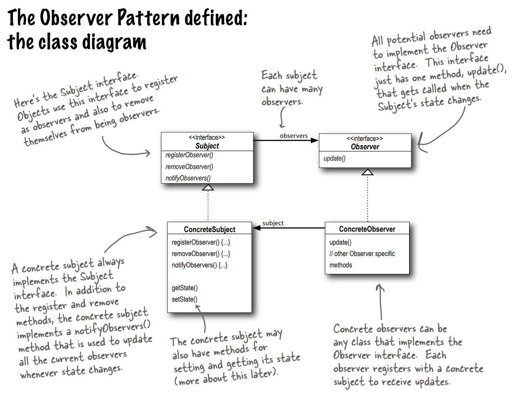

# 옵저버 패턴

**옵저버 패턴(Observer Pattern)**에서는 한 객체의 상태가 바뀌면 그 객체에 의존하는 다른 객체들한데 연락이 가고 자동으로 내용이 갱신되는 방식으로 **일대다(one-to-many)** 의존성을 정의한다.

>옵저버 패턴은 뭔가 중요한 일이 일어났을 때 하나의 중앙 객체에서 다른 객체들한테 새소식을 알려줄 수 있고 객체 쪽에서는 계속해서 정보를 받을지 여부를 실행중에 결정할 수 있다.

**출판사+구독자=옵저버 패턴**

위 그림에서의 옵저버(observer, or 구독자) 객체는 스스로 추가되거나 제거될 수 있다.
 
주제(subject, or 출판사) 객체는 일부 데이터를 관리하고 데이터가 변경되었을 때 모든 옵저버들에게 변경사항을 알려준다.

>주제와 옵저버의 관계는 일대다 관계이다.

## 느슨한 결합(Loose Coupling)

두 객체가 느슨하게 결합되어 있다는 것은, 그 둘이 상호작용을 하긴 하지만 서로에 대해 서로 잘 모른다는 것을 의미한다.

옵저버 패턴에서는 주제와 옵저버가 느슨하게 결합되어 있는 객체 디자인을 제공한다.

## 옵저버 패턴에서 느슨한 결합을 객체 디자인을 제공하는 요소들

- 주제가 옵저버에 대해서 아는 것은 옵저버가 특정 인터페이스(Observer 인터페이스)를 구현한다는 것 뿐이다.
  - 옵저버의 동작에 대해서는 알 필요가 없다.
- 옵저버는 언제든지 새로 추가할 수 있다.
  - 주제는 Observer 인터페이스를 구현하는 객체의 목록에만 의존하기 때문에 옵저버는 언제든지 추가되거나 삭제되어도 상관 없다.
- 새로운 형식의 옵저버를 추가하려고 할 때도 주제를 전혀 변경할 필요가 없다.
  - Observer 인터페이스만 구현한다면 어떤 객체도 상관없이 주제는 연락이 가능하다.
- 주제와 옵저버는 서로 독립적으로 재사용할 수 있다.
- 주제나 옵저버가 바뀌더라도 서로한테 영향을 미치지 않는다.

>디자인 원칙: 서로 상호작용하는 객체 사이에는 가능하면 느슨하게 결합하는 디자인을 사용해야 한다.
>느슨하게 결합하는 디자인을 사용하면 객체사이의 상호의존성을 최소화할 수 있기 때문에 변경사항이 생겨도 무난히 처리할 수 있는 유연한 객체지향 시스템을 구축할 수 있다. 

