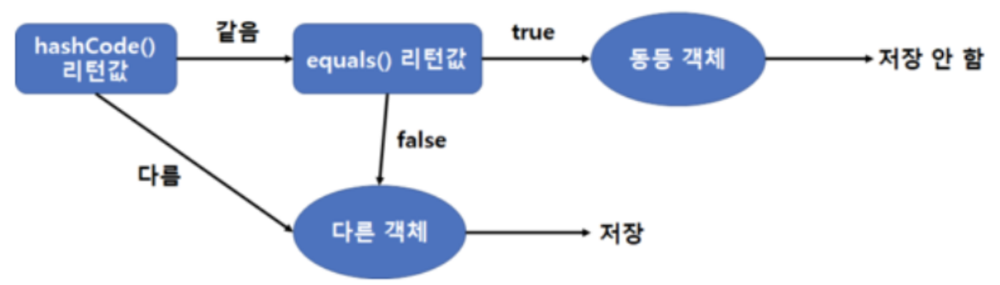
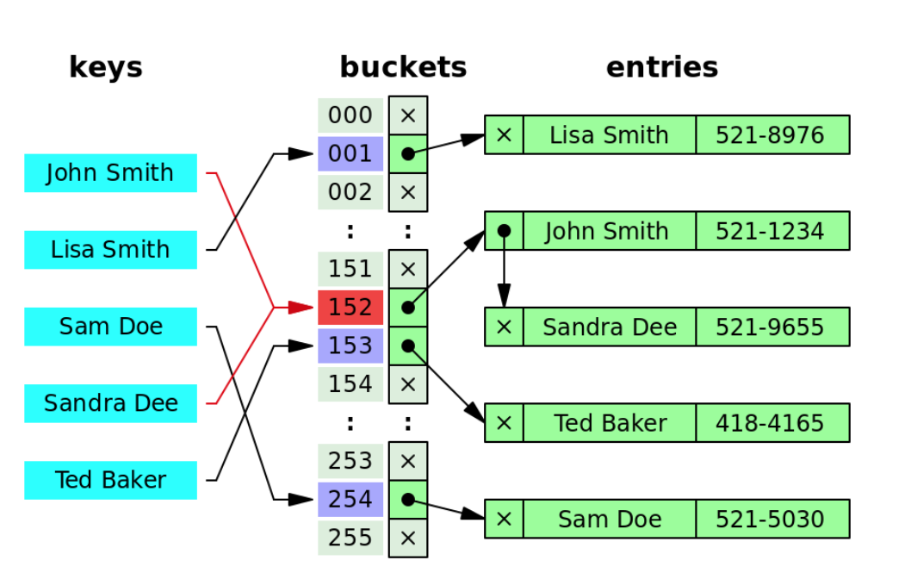

# equals를 재정의하려거든 hashCode도 재정의하라

**equals를 재정의한 클래스 모두에서 hashCode도 재정의해야 한다.**

HashMap이나 HashSet 같은 컬렉션의 원소로 사용할 때 hashCode의 일반 규약에 맞게 재정의되어 있지 않다면 문제가 발생한다.

- Object 명세의 hashCode 일반 규약
  - equals 비교에 사용되는 정보가 변경되지 않았다면, 애플리케이션이 실행되는 동안 그 객체의 hashCode 메서드는 몇 번을 호출해도 일관되게 항상 같은 값을 반환해야 한다.
    단, 애플리케이션을 다시 실행한다면 이 값이 달라져도 상관없다.
  - equals(Object)가 두 객체를 같다고 판단했다면, 두 객체의 hashCode는 똑같은 값을 반환해야 한다.
  - equals(Object)가 두 객체를 판단했더라도, 두 객체의 hashCode가 서로 다른 값을 반환할 필요는 없다. 
    단, 다른 객체에 대해서는 다른 값을 반환해야 해시테이블의 성능이 좋아진다.

>논리적으로 같은 객체는 같은 해시코드를 반환해야 한다.

- hashCode를 재정의하지 않았을 때 발생하는 문제 상황

```java
Map<PhoneNumber, String> m = new HashMap<>();
m.put(new PhoneNumber(707, 867, 5309), "제니");
m.get(new PhoneNumber(707, 867, 5309), "제니"); // 논리적 동치이지만 조회 불가능
```

- equals와 hashCode 함수 관계(1)



## hashCode에 따른 발생 상황

이상적인 해시 함수는 주어진 (서로 다른) 인스턴스들을 32비트 정수 범위에 균일하게 분배해야 한다.

- hashCode 결과 값에 따른 hashTable 예시(2)



>나쁜 해시 함수는 모든 객체가 해시테이블의 버킷 하나에 담겨 연결 리스트(linked list)처럼 동작하여 성능 저하가 발생하는 상황을 초래한다.

## 좋은 hashCode를 작성하는 요령

```java
@Override
public int hashCode() {
    int result = Short.hashCode(field1);
    result = 31 * reuslt + Integer.hashCode(field2);
    result = 31 * result + Integer.hashCode(field3);
    return result;
}
```

- 필드의 값이 기본 타입이면 박싱 클래스의 hashCode를 사용해 계산한다.
- 참조 타입 필드라면 참조 타입에 대한 표준 hashCode를 만들거나 이미 있다면 해당 hashCode를 사용한다.
  - 필드 값이 null일 때는 0을 사용한다.
- 필드가 배열이면 각각의 원소도 필드처럼 다룬다(모든 원소가 핵심이 아닐 수 있다). 
  - 배열에 원소가 하나도 없다면 상수(0 추천)을 사용한다. 
  - 배열의 모든 원소가 핵심 필드면 Arrays.hashCode를 사용한다.  
- 재정의한 hashcode가 동치인 인스턴스에 대해 똑같은 해시코드를 반환할지 TestCase는 꼭 작성한다.
- 파생 필드는 해시 코드 계산에서 제외한다(다른 필드로부터 계산해 낼 수 있는 필드는 무시).
- equals 비교에 사용되지 않은 필드는 '반드시' 제외한다.
- 31 * result는 필드를 곱하는 순서에 따라 result 값이 달라진다.
- 곱할 숫자가 31인 이유는 31이 홀수이면서 소수이기 때문이다(짝수일때 오버플로우가 발생하면 정보를 잃게 된다, 소수는 전통적인 방법이다).  

## 추가 사항들
- hash 메서드
  - Objects 클래스가 제공하는 임의의 개수만큼 객체를 받아 해시코드를 계산해주는 정적 메서드 
  - 입력 인수를 담기 위한 배열을 만들고 기본타입에 대한 박싱, 언박싱 때문에 속도가 느린 단점이 있다

```java
@Override
public int hashCode() {
    return Objects.hash(name, number, age);
}
```
- 캐싱 방식
  - 클래스가 불변이고 해시코드를 계산하는 비용이 크면 매번 계산하지 않고 해시코드를 미리 계산해두는 방식이 있다.
- 지연 초기화
  - 해시의 키로 사용되지 않는 경우라면 hashCode가 처음 불릴 때 계산하는 방식이 있다(대신 스레드 안전하게 만들어야 한다).
- 성능을 높이려 해시코드를 계산할 때 핵심 필드를 생략하면 안 된다. 

## 핵심 정리

- equals를 재정의하면 hashCode도 반드시 재정의해야 한다.
- 프로그램이 제대로 동작하려면 hashCode를 Object의 API 문서에 기술된 규약에 따라 잘 구현해야 한다.
- 잘 만들어진 프레임 워크(AutoValue)도 사용해보자

## 참고

- (1) equals_hashCode 그림 : 이것이 자바다 서적
- (2) hashCode_hashTable 그림 : https://en.wikipedia.org/wiki/Hash_table


