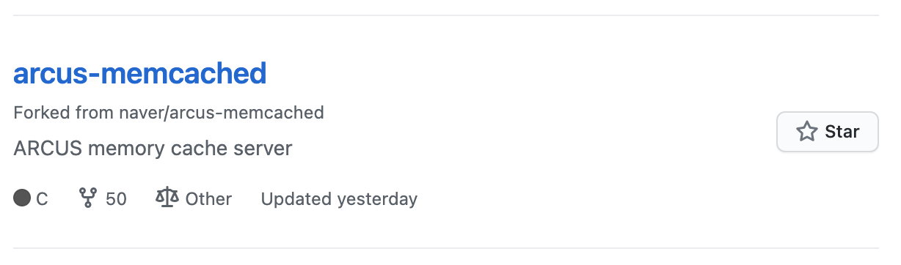
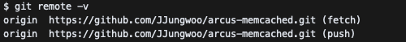
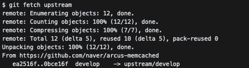
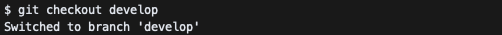
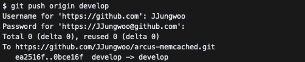
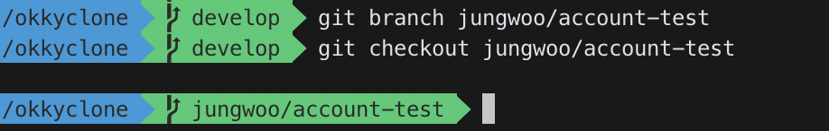
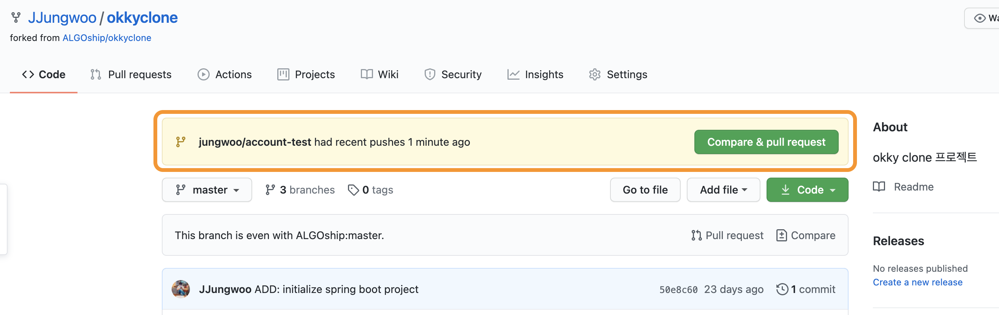
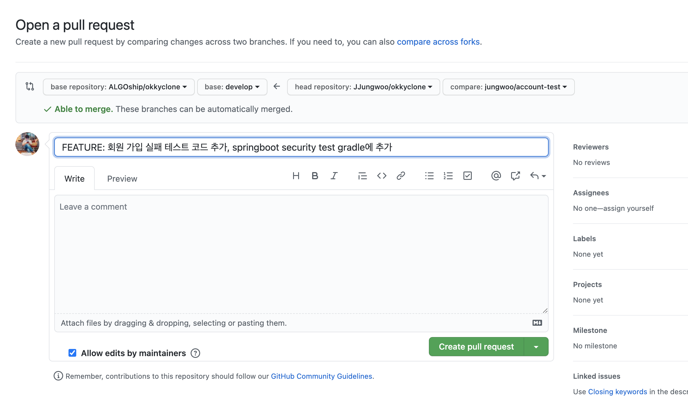
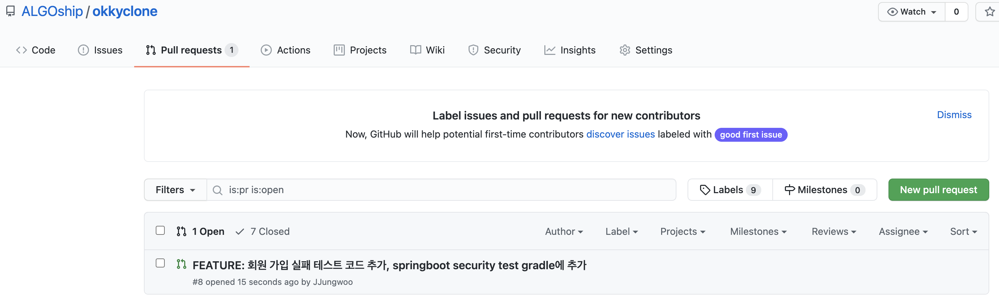

# git 초보자를 위한 꿀팁 모음 - 오픈소스 기여하기

해당 글은 git 초보자가 특정 오픈소스에 pull request(이하 pr) 요청 통해 기여하는 과정을 돕기 위한 가이드 라인 문서입니다.

### 목차
  - [Fork 해서 내 저장소에 복사하기](#Fork-해서-내-저장소에-복사하기)
  - [저장소 항상 최신 코드로 동기화하기](#저장소-항상-최신-코드로-동기화하기)
  - [Fork 한 코드에 Branch 새로 만들어 작업하기](#Fork-한-코드에-Branch-새로-만들어-작업하기)
  - [작업한 코드를 원본 저장소에 PR 기여하기](#작업한-코드를-원본-저장소에-PR-요청하기)

<br>

## Fork 해서 내 저장소에 복사하기

누군가의 오픈소스에 기여하기 위해 먼저 해야할 작업은 원본이 되는 대상 오픈소스 프로젝트를 내 github 저장소로 가져와야 한다. 이후에 내가 추가하고 싶은 내용을 편집하고 변경사항을 원본에 요청할 수 있기 때문이다.

원본 프로젝트의 저장소를 들어가보면 오른쪽 상단에 `Fork` 버튼을 선택하여 내 github 저장소에 복사할 수 있다.


원본 프로젝트 저장소에서 Fork를 하면 자신의 저장소에 새로 복사된 것을 확인할 수 있다.



따라서 이후 작업은 fork한 저장소에서 진행하면 된다.

<br>

## 저장소 항상 최신 코드로 동기화하기

보통 처음 pr를 하거나 pr을 많이 해보지 않았다면 해당 작업을 안해본 사람들이 많을 것이다. 
왜냐면 보통 처음 fork를 한 다음엔 코드가 최신이기 때문에 따로 최신으로 갱신해줄 필요가 없기 때문이다.
하지만 fork를 한 다음 지속적으로 기여를 하다보면 대다수의 오픈소스들은 계속 누군가에 의해 코드가 변경될 것이다.

만약 원본 프로젝트의 코드를 최신화하지 않으면 코드를 pr 하는 순간, 수 많은 충돌로 인해 멘붕하게 된다.😱😱

그렇기 때문에 자신의 저장소에 fork 한 프로젝트를 항상 최신화 하는 작업이 매우 중요하다.👍👍

- 원본 저장소 원격지 목록에 추가하기

먼저 fork 한 프로젝트를 clone 하여 작업할 공간을 만든다. 그 다음 `git remote -v` 명령을 통해 현재 원격 저장소로 등록된 목록을 확인해준다. 



아직은 origin으로 등록된 내 원격 저장소의 프로젝트 경로만 보인다. 이제 원본 프로젝트를 다음의 명령으로 추가해주자.

```git
$ git remote add upstream (원본 프로젝트 url 경로)
```

원본 프로젝트의 url 경로를 추가해주면 다음과 같이 등록된 것을 확인할 수 있다.


- 현재 로컬 저장소 코드 최신 코드로 갱신하기

이제 fetch 명령을 통해 원본 프로젝트의 최신 코드를 현재 작업중인 로컬 저장소로 가져온다.

```git
$ git fetch (코드를 가져올 원격 저장소)
```

`git fetch` 명령어는 코드를 가져올 프로젝트를 위에서 설정한 upstream 으로 입력해준다. 



명령어가 제대로 실행되었다면 `upstream` 으로 설정한 원본 프로젝트의 최신 코드를 가져올 수 있다.

그 다음 최신 코드로 적용하기 위한 branch에 checkout 한 뒤 나의 로컬 저장소에 merge 하면 최신 코드가 적용이 된다.



```git
$ git merge (원격 저장소/브랜치) (코드를 합칠 현재 나의 로컬 저장소의 브랜치)
```


- 나의 github 저장소 최신 코드로 갱신하기

마지막으로 merge 완료한 최종 코드를 나의 원격 저장소에 push 하여 나의 github 저장소의 코드도 최신으로 갱신할 수 있다.



<br>

## Fork 한 코드에 Branch 새로 만들어 작업하기

이제 개발 준비는 다 되었다. 실제 오픈소스에 기여하기 위한 작업을 위해 나만의 작업 branch를 만들어 주자.

위에서 fork 한 나의 원격 저장소의 코드를 clone을 통해 가져온 다음 작업하기 위한 branch를 새로 만들어서 작업을 진행하도록 하자.



> branch 명은 자신이 작업할 기능 혹은 내용에 대해 추측할 수 있는 이름으로 정하면 나중에 어떤 내용이 수정된 건지 예측이 가능하여 관리하기에 좋다.

## 작업한 코드를 원본 저장소에 PR 요청하기

이후 생성한 branch 에서 작업을 한다음 자신의 origin 저장소에 코드를 push 하면 자신의 github 저장소에 다음과 같이 이벤트가 발생한다.



그러면 이제 `compare & pull request` 버튼을 눌러 원본 프로젝트에 pr 요청을 할수 있다.

> 항상 pr 요청하기 전에 신중하게 자신이 pr 요청하려는 commit 내역이 제대로 되었는지 꼭 한번더 확인하는 습관을 갖도록 하자



pr 요청을 하면 아래처럼 pr 메시지와 자신의 코드를 merge할 원본 프로젝트의 branch를 선택할 수 있다.

> pr 메시지는 되도록 변경 사항에 대해 구체적으로 작성해주자

pr 메시지 작성과 merge할 branch를 선택한 뒤에 `Create pull request` 를 눌러 pr 을 생성하면 아래와 같이 pr 이 만들어진 것을 확인할 수 있다. 🥳




처음 오픈소스에 기여하는 것은 쉽지 않다. 각각의 오픈소스마다 자신들만의 규칙이 있고 기여를 하려면 해당 코드에 대해 분석도 필요하고 깃을 처음 다루는 사람이라면 간단한 pr 요청 조차도 하기 어렵다.

하지만 따로 연습 저장소를 만들어 연습을 하고 반복된 기여 작업을 하다보면 어느 순간 쉽게 깃을 다루고 해당 오픈소스에 나의 코드를 많이 기여할 거라 생각한다.

다양한 코드를 많이 접해보고 꾸준히 기여할 수 있도록 노력하자. 👍👍 

