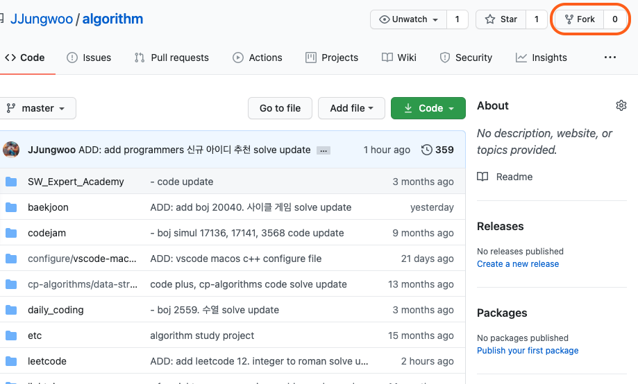
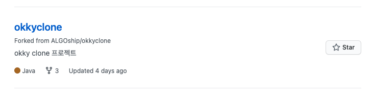
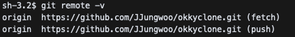
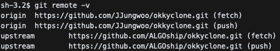

# git 초보자를 위한 꿀팁 모음 - Pull Request

해당 글은 git 초보자가 특정 오픈소스에 pull request(이하 pr) 요청을 하며 기여하는 과정을 돕기 위한 가이드 라인 문서입니다.

- 목차
  - [Fork 해서 내 저장소에 복사하기](#Fork-해서-내-저장소에-복사하기)
  - [저장소 항상 최신 코드로 동기화하기](#저장소-항상-최신-코드로-동기화하기)
  - [Fork 한 코드에 브랜치 새로 만들어 작업하기](#Fork-한-코드에-브랜치-새로-만들어-작업하기)
  - [작업한 코드 원본 저장소 코드에 기여하기](#작업한-코드를-원본-저장소에-pr-요청하기)

### Fork 해서 내 저장소에 복사하기

누군가의 오픈소스에 기여하기 위해 먼저 해야할 작업은 원본이 되는 대상 프로젝트의 저장소를 내 저장소로 가져와야 한다. 이후에 내가 추가하고 싶은 내용을 편집하고 변경사항을 원본에 요청할 수 있기 때문이다.

원본 프로젝트의 저장소를 들어가보면 오른쪽 상단에 Fork를 선택하여 내 github 저장소에 복사할 수 있다.



원본 프로젝트 저장소에서 Fork를 하면 자신의 저장소에 새로 복사된 것을 확인할 수 있다.



따라서 이후 작업은 Fork한 저장소에서 진행하면 된다.

### 저장소 항상 최신 코드로 동기화하기

보통 처음 pr를 하거나 pr을 많이 해보지 않았다면 해당 작업을 안해본 사람들이 많을 것이다. 
왜냐면 보통 처음 fork를 한 다음엔 코드가 최신이기 때문에 따로 최신으로 갱신해줄 필요가 없기 때문이다. 
하지만 fork를 한 다음 지속적으로 기여를 하다보면 대다수의 오픈소스들은 계속 누군가에 의해 코드가 변경될 것이다.

만약 원본 프로젝트의 코드를 최신화하지 않으면 코드를 pr 하는 순간 수 많은 충돌로 인해 멘붕하게 된다.😱😱

그렇기 때문에 자신의 저장소에 fork 한 프로젝트를 항상 최신화 하는 작업이 매우 중요하다.👍👍

- 원본 저장소 원격지 목록에 추가하기

먼저 fork 한 프로젝트를 clone 하여 작업할 공간을 만든다. 그 다음 `git remote -v` 명령을 통해 현재 원격 저장소로 등록된 목록을 확인해준다. 



아직은 origin으로 등록된 내 원격 저장소의 프로젝트 경로만 보인다. 이제 원본 프로젝트를 다음의 명령으로 추가해주자.

```git
$ git remote add upstream {원본 프로젝트 url 경로}
```

원본 프로젝트의 url 경로를 추가해주면 다음과 같이 등록된 것을 확인할 수 있다.



이제 원본 프로젝트의 최신 코드를 가져와 현재 작업중인 공간으로 가져온다.


### Fork 한 코드에 브랜치 새로 만들어 작업하기


### 작업한 코드를 원본 저장소에 pr 요청하기

