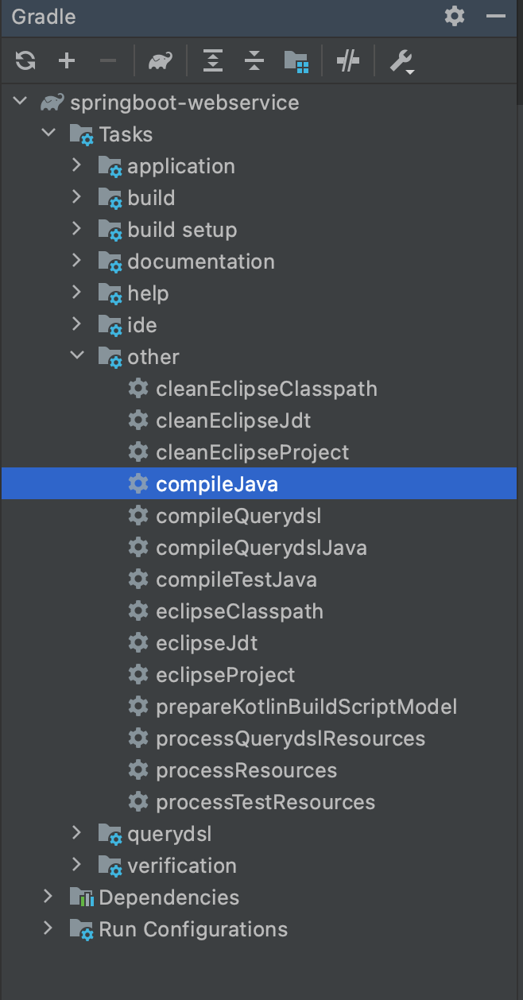
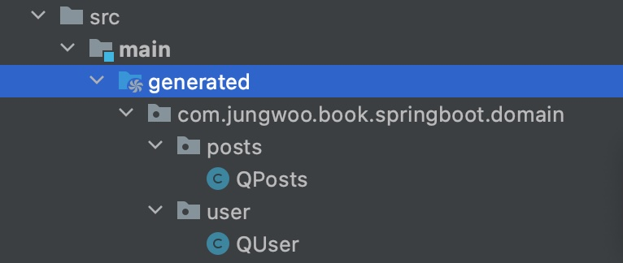
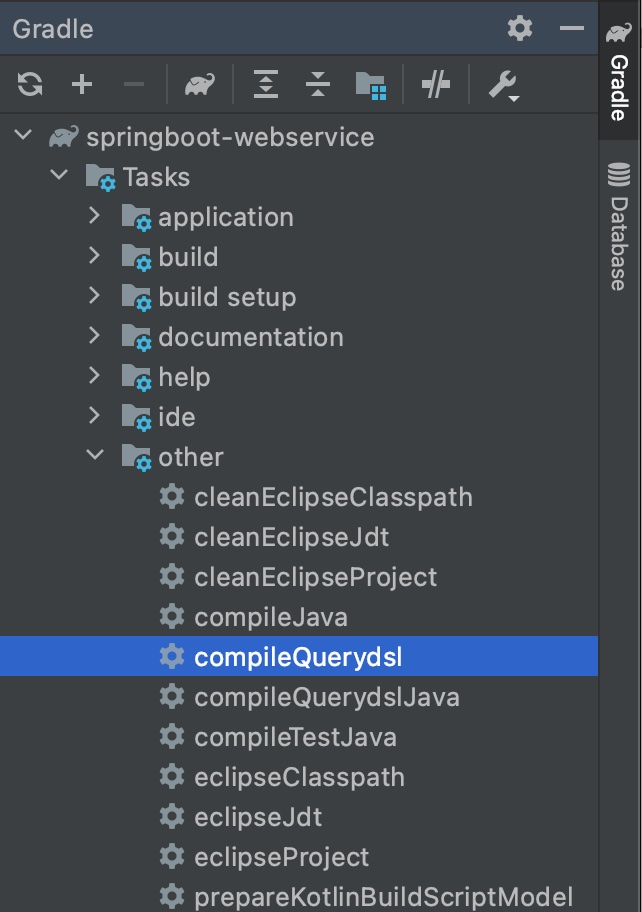
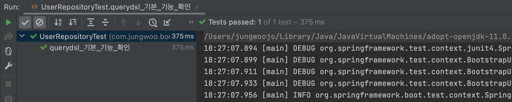

# queryDsl 초기 설정 및 테스트 코드 작성

이번 게시글에서는 querydsl 을 springboot 프로젝트에 추가하고 간단한 테스트 코드를 통해 querydsl 사용 방법을 소개한다.

먼저 프로젝트 초기 build.gradle 에 아래의 의존성 코드를 추가해준다.

### build.gradle

```
buildscript{
    ext {
        ...
        querydslPluginVersion = '1.0.10' // 플러그인 버전
    }

    repositories {
        ...
        maven { url "https://plugins.gradle.org/m2/" } // 플러그인 저장소
    }

    dependencies {
        // querydsl 플러그인 의존성 등록
        classpath("gradle.plugin.com.ewerk.gradle.plugins:querydsl-plugin:${querydslPluginVersion}") 
    }
}

dependencies {
    ...
    // queryDsl 의존성 추가
    compile("com.querydsl:querydsl-core:4.2.1")
    compile("com.querydsl:querydsl-apt:4.2.1")
    compile("com.querydsl:querydsl-jpa:4.2.1")
    compile("com.querydsl:querydsl-collections:4.2.1")
    ...
    annotationProcessor("com.querydsl:querydsl-apt:${dependencyManagement.importedProperties['querydsl.version']}:jpa") // querydsl JPAAnnotationProcessor 사용 지정
    annotationProcessor("jakarta.persistence:jakarta.persistence-api") // java.lang.NoClassDefFoundError(javax.annotation.Entity) 발생 대응
    annotationProcessor("jakarta.annotation:jakarta.annotation-api") // java.lang.NoClassDefFoundError (javax.annotation.Generated) 발생 대응

}

// querydsl 적용
apply plugin: "com.ewerk.gradle.plugins.querydsl" // Plugin 적용
def querydslSrcDir = 'src/main/generated' // QClass 생성 위치

querydsl {
    library = "com.querydsl:querydsl-apt"
    jpa = true
    querydslSourcesDir = querydslSrcDir
}

compileQuerydsl {
    options.annotationProcessorPath = configurations.querydsl
}

sourceSets {
    main {
        java {
            srcDirs = ['src/main/java', querydslSrcDir]
        }
    }
}
```

### application.properties

실행 과정에서 "The bean 'jpaAuditingHandler', defined in null, could not be registered. A bean with that name has already been defined in null and overriding is disabled." 이런 에러 메시지가 발생하면 application.properties 에 다음 내용을 추가해주면 된다.

```
spring.main.allow-bean-definition-overriding=true
```

이후 QClass를 생성하려면 아래의 사진처럼 Gradle Project에서 compileJava를 실행시켜주면 src/main/generated 에 QClass가 생성된다.






### Java Config

이제는 querydslconfig 클래스를 생성해준다.

```java
import com.querydsl.jpa.impl.JPAQueryFactory;
import org.springframework.context.annotation.Bean;
import org.springframework.context.annotation.Configuration;
import org.springframework.data.jpa.repository.config.EnableJpaAuditing;

import javax.persistence.EntityManager;
import javax.persistence.PersistenceContext;

@EnableJpaAuditing
@Configuration
public class QuerydslConfig {

    @PersistenceContext
    private EntityManager entityManager;

    @Bean
    public JPAQueryFactory jpaQueryFactory() {
        return new JPAQueryFactory(entityManager);
    }
}
```

이후 프로젝트 내부 다른 자바 클래스 어디에서도 JPAQueryFactory를 주입 받아 querydsl을 사용할 수 있다.

### querydsl 적용하기

실제 프로젝트 내부 User 객체 클래스에 적용하려 한다. 먼저 User 클래스와 UserRepository 를 추가해준다.

```java
...
@Getter
@NoArgsConstructor(access = AccessLevel.PROTECTED)
@Entity
public class User extends BaseTimeEntity {

    @Id
    @GeneratedValue(strategy = GenerationType.IDENTITY)
    private Long id;

    @Column(nullable = false)
    private String name;

    @Column(nullable = false)
    private String email;

    @Column
    private String picture;

    @Enumerated(EnumType.STRING)
    @Column(nullable = false)
    private Role role;

    @Builder
    public User(String name, String email, String picture, Role role) {
        this.name = name;
        this.email = email;
        this.picture = picture;
        this.role = role;
    }

    ...
```

```java
public interface UserRepository extends JpaRepository<User, Long> {

}

```

이제 querydsl를 지원하는 UserRepositorySupport 클래스를 추가해준다.

```java
package com.jungwoo.book.springboot.domain.user;

import com.querydsl.jpa.impl.JPAQueryFactory;
import org.springframework.data.jpa.repository.support.QuerydslRepositorySupport;
import org.springframework.stereotype.Repository;

import static com.jungwoo.book.springboot.domain.user.QUser.user;

import java.util.List;

@Repository
public class UserRepositorySupport extends QuerydslRepositorySupport {
    private final JPAQueryFactory queryFactory;

    public UserRepositorySupport(JPAQueryFactory queryFactory) {
        super(User.class);
        this.queryFactory = queryFactory;
    }

    public List<User> findByName(String name) {
        return queryFactory
                .selectFrom(user)
                .where(user.name.eq(name))
                .fetch();
    }

}
```

이때 findByName 함수에서 user를 인식하지 못하는 데, 아래의 방법을 통해 querydsl에서 QClass로 생성된 user를 인식하도록 해준다.

아까와 마찬가지로 아래의 사진처럼 gradle project 에 compileQuerydsl 을 눌러서 인식하도록 할수 있다.



### querydsl 테스트 코드 작성하기

아래의 테스트 코드를 통해 기능이 제대로 되는지 확인할수 있다.

```java
...
import org.junit.After;
import org.junit.Test;
import org.junit.runner.RunWith;
import org.springframework.beans.factory.annotation.Autowired;
import org.springframework.boot.test.context.SpringBootTest;
import org.springframework.test.context.junit4.SpringRunner;

import java.util.List;

import static com.jungwoo.book.springboot.domain.user.Role.USER;
import static org.assertj.core.api.Assertions.assertThat;

@RunWith(SpringRunner.class)
@SpringBootTest
public class UserRepositoryTest {

    @Autowired
    private UserRepository userRepository;

    @Autowired
    private UserRepositorySupport userRepositorySupport;

    @After
    public void down() throws Exception {
        userRepository.deleteAllInBatch();
    }

    @Test
    public void querydsl_기본_기능_확인() {
        //given
        String name = "jungwoo";
        String address = "jungwoo@gmail.com";
        String picture = "???";
        Role role = USER;

        userRepository.save(User.builder()
                                .name(name)
                                .email(address)
                                .picture(picture)
                                .role(role)
                                .build());

        //when
        List<User> result = userRepositorySupport.findByName(name);

        //then
        assertThat(result.get(0).getEmail().equals(address));
    }
}
```



ref
- https://stackoverflow.com/questions/53787550/jpaauditinghandler-defined-in-null-on-application-startup-using-spring-boot
- https://jojoldu.tistory.com/372
- https://github.com/ewerk/gradle-plugins/issues/112
- http://honeymon.io/tech/2020/07/09/gradle-annotation-processor-with-querydsl.html


